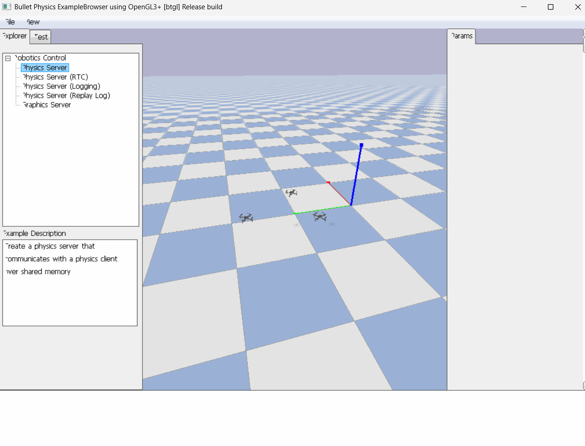
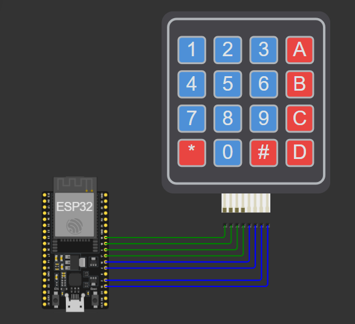

# 🚁 Control de Drones con ESP32 + PyBullet

Sistema de simulación y control de múltiples drones mediante una **ESP32**, un **teclado matricial 4×4** y **PyBullet** utilizando `gym-pybullet-drones`.

El proyecto permite controlar tres drones virtuales desde la ESP32 mediante comunicación **Serial USB**.

---

## 📌 Descripción

El sistema está compuesto por:

```text
Teclado 4×4
     │
     ▼
   ESP32
     │
   Serial USB
     │
     ▼
   Python
     │
     ▼
PyBullet / gym-pybullet-drones
     │
 ┌───┼───┐
 ▼   ▼   ▼
D0   D1  D2
```

Los drones realizan un movimiento circular con variación vertical mientras esperan una orden.

Al recibir una tecla, Python cambia el destino de los drones.

---

## ⚙️ Tecnologías

* Python 3
* PyBullet
* `gym-pybullet-drones`
* NumPy
* PySerial
* ESP32
* Arduino IDE
* Teclado matricial 4×4

---

## 📁 Estructura

```text
Control_Drones/
│
├── main.py
├── control_esp32.ino
├── gym_pybullet_drones/
└── README.md
```

### `main.py`

Programa principal del proyecto.

Se encarga de:

* Crear los tres drones.
* Inicializar PyBullet.
* Recibir comandos de la ESP32.
* Calcular las trayectorias.
* Controlar la velocidad de los drones.
* Gestionar los puntos A, B y D.
* Ejecutar el aterrizaje.

### `control_esp32.ino`

Programa de la ESP32.

Se encarga de:

* Leer el teclado matricial.
* Detectar las teclas.
* Enviar los comandos mediante Serial.
* Mostrar las órdenes recibidas localmente.

---

## 🎮 Control

| Tecla | Acción                         |
| ----- | ------------------------------ |
| `A`   | Ir al punto A                  |
| `B`   | Ir al punto B                  |
| `D`   | Ir al punto D                  |
| `*`   | Regresar a la posición inicial |
| `#`   | Aterrizar                      |

Las demás teclas no tienen una función de control.

---

## 🛸 Funcionamiento

### 1. Estado de espera

Al iniciar, los tres drones vuelan alrededor de una zona central realizando una trayectoria circular.

Además, se aplica una pequeña variación en el eje **Z**, produciendo un movimiento de subida y bajada.

### 2. Selección de destino

Cuando se pulsa `A`, `B` o `D`:

```text
ESP32
  ↓
Serial
  ↓
Python
  ↓
Nuevo objetivo
  ↓
Movimiento de los drones
```

Los drones se desplazan progresivamente hacia el destino seleccionado.

No se utiliza teletransporte: Python calcula continuamente el error entre la posición actual y el objetivo y genera una velocidad para reducirlo.

### 3. Formación

Los tres drones mantienen una separación entre ellos mediante una formación relativa al punto seleccionado.

Ejemplo:

```text
       🚁  🚁  🚁
          Punto B
```

### 4. Regreso y aterrizaje

`*` devuelve los drones a sus posiciones iniciales.

`#` reduce progresivamente la altura hasta realizar el aterrizaje.

---

## 🔌 Conexión del teclado

Configuración utilizada:

| Teclado |   ESP32 |
| ------- | ------: |
| R1      | GPIO 13 |
| R2      | GPIO 14 |
| R3      | GPIO 27 |
| R4      | GPIO 26 |
| C1      | GPIO 25 |
| C2      | GPIO 33 |
| C3      | GPIO 32 |
| C4      | GPIO 35 |

Distribución:

```text
┌───┬───┬───┬───┐
│ 1 │ 2 │ 3 │ A │
├───┼───┼───┼───┤
│ 4 │ 5 │ 6 │ B │
├───┼───┼───┼───┤
│ 7 │ 8 │ 9 │ C │
├───┼───┼───┼───┤
│ * │ 0 │ # │ D │
└───┴───┴───┴───┘
```

---

## 💻 Instalación

Crear y activar un entorno virtual:

```bash
python -m venv venv
```

Windows:

```powershell
.\venv\Scripts\activate
```

Instalar dependencias:

```bash
pip install numpy pyserial gymnasium pybullet transforms3d
```

Instalar el proyecto:

```bash
pip install -e .
```

---

## ▶️ Ejecución

1. Conectar la ESP32 al PC.
2. Cargar `control_esp32.ino`.
3. Identificar el puerto COM de la ESP32.
4. Modificar en `main.py`:

```python
PUERTO_ESP32 = "COM5"
```

por el puerto correspondiente.

5. Cerrar el Monitor Serial de Arduino IDE.
6. Ejecutar:

```bash
python main.py
```

Se abrirá la simulación de PyBullet con los tres drones.

---

## 📡 Comunicación

La comunicación utiliza:

```text
Baudrate: 115200
```

Los comandos enviados por la ESP32 son caracteres individuales:

```text
A
B
D
*
#
```

Python interpreta estos comandos y modifica el estado de la simulación.

---

## 🧩 Flujo del sistema

```text
                 ┌──────────────┐
                 │ Teclado 4×4  │
                 └──────┬───────┘
                        │
                        ▼
                 ┌──────────────┐
                 │    ESP32     │
                 └──────┬───────┘
                        │
                    Serial USB
                        │
                        ▼
                 ┌──────────────┐
                 │    Python    │
                 └──────┬───────┘
                        │
                        ▼
              ┌────────────────────┐
              │ gym-pybullet-drones│
              └─────────┬──────────┘
                        │
                 ┌──────┼──────┐
                 ▼      ▼      ▼
                🚁     🚁     🚁
                D0     D1     D2
```

---

## 📷 Evidencias

### Simulación





### Diagrama del sistema




## 📚 Base del proyecto

El sistema utiliza [`gym-pybullet-drones`](https://github.com/learnsyslab/gym-pybullet-drones), un entorno basado en PyBullet para simulación y control de drones.

## 👨‍💻 Autores

**Jordan Alejandro Rodriguez Torres**
**Nicolas Robayo Gomez**
**Camilo Molano** 


Proyecto académico — Ingeniería Mecatrónica
Universidad Militar Nueva Granada